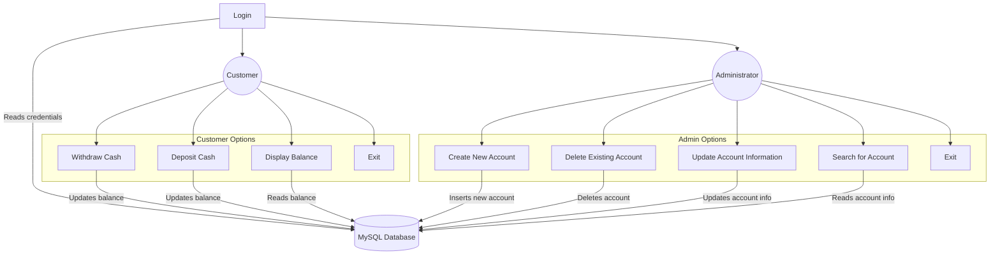
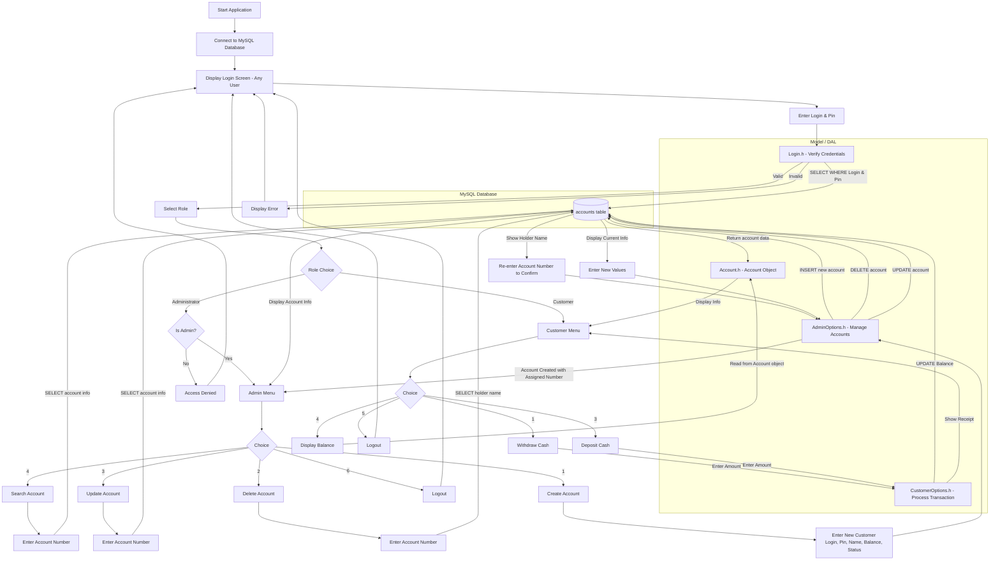
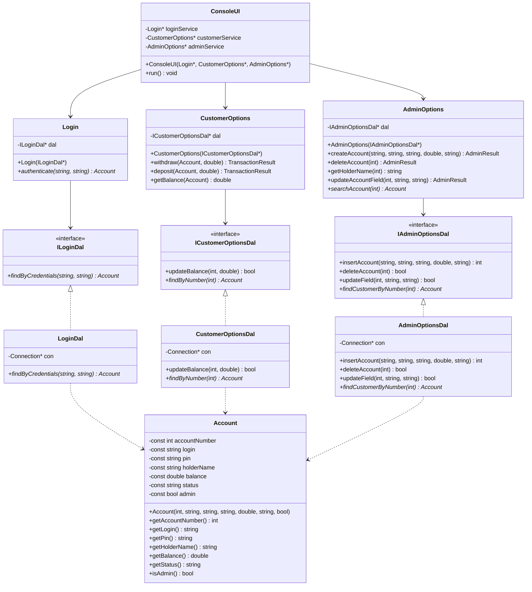
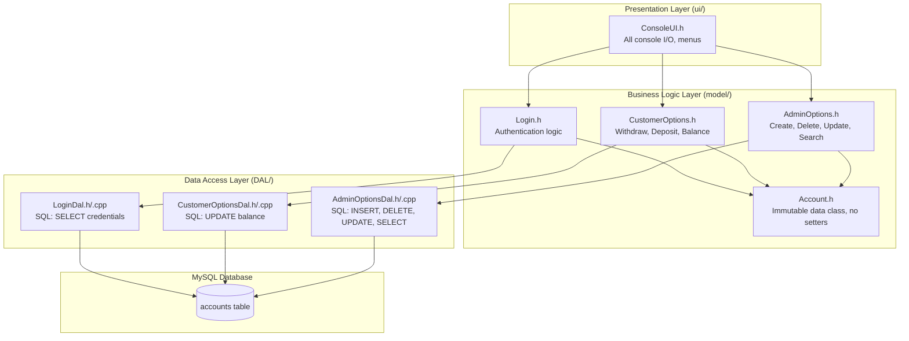
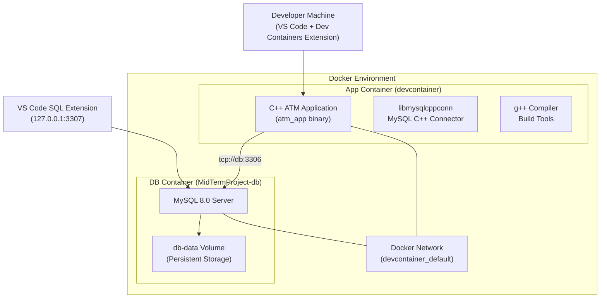

# ATM System Diagrams

## 1. Use Case Diagram

### Actors
- **Customer** — A user with a bank account who can perform transactions
- **Administrator** — A privileged user who manages customer accounts

### Use Case Descriptions

| Use Case | Actor(s) | Description |
|----------|----------|-------------|
| Login | Customer, Admin | User enters login and 5-digit pin. System verifies credentials against the database. |
| Select Role | Customer, Admin | After login, user selects Customer or Administrator role. Access is validated. |
| Withdraw Cash | Customer | Customer enters amount to withdraw. System validates (positive, sufficient funds), updates balance in DB, displays receipt. |
| Deposit Cash | Customer | Customer enters amount to deposit. System validates (positive), updates balance in DB, displays receipt. |
| Display Balance | Customer | System displays account number, current date, and balance. |
| Create New Account | Admin | Admin enters login, pin, name, balance, status. System validates pin (5 digits), checks for duplicate login, creates account. |
| Delete Existing Account | Admin | Admin enters account number. System shows holder name, asks for re-confirmation, deletes account. |
| Update Account Information | Admin | Admin enters account number. System shows current info. Admin can update holder, balance, status, login, or pin. |
| Search for Account | Admin | Admin enters account number. System displays full account details. |
| Logout / Exit | Customer, Admin | User exits their menu and returns to the login screen. |

---

## 2. System Diagram for entire application

---

## 3. Class Diagram

---

## 4. Component Diagram (Layered Architecture)

### Component Responsibilities

| Layer | Component | File | Responsibility |
|-------|-----------|------|----------------|
| UI | ConsoleUI | `src/ui/ConsoleUI.h` | All std::cin/std::cout, menus, user input |
| Model | Account | `src/model/Account.h` | Immutable data class (constructor, const members, no setters) |
| Model | Login | `src/model/Login.h` | Authentication business logic |
| Model | CustomerOptions | `src/model/CustomerOptions.h` | Withdraw/deposit validation and logic |
| Model | AdminOptions | `src/model/AdminOptions.h` | Account CRUD validation and logic |
| DAL | LoginDal | `src/DAL/LoginDal.h/.cpp` | SQL only: credential queries |
| DAL | CustomerOptionsDal | `src/DAL/CustomerOptionsDal.h/.cpp` | SQL only: balance updates |
| DAL | AdminOptionsDal | `src/DAL/AdminOptionsDal.h/.cpp` | SQL only: account CRUD queries |
| Entry | main.cpp | `src/main.cpp` | Wires DAL -> model -> UI together |

---

## 4. Deployment Diagram

### Deployment Details

| Component | Container | Port | Notes |
|-----------|-----------|------|-------|
| C++ App | `devcontainer-app` | N/A | Runs inside dev container, connects to DB via service name `db` |
| MySQL 8.0 | `MidTermProject-db` | 3306 (internal), 3307 (host) | Persistent data via `db-data` Docker volume |
| Docker Network | `devcontainer_default` | — | Enables container-to-container communication via DNS |

